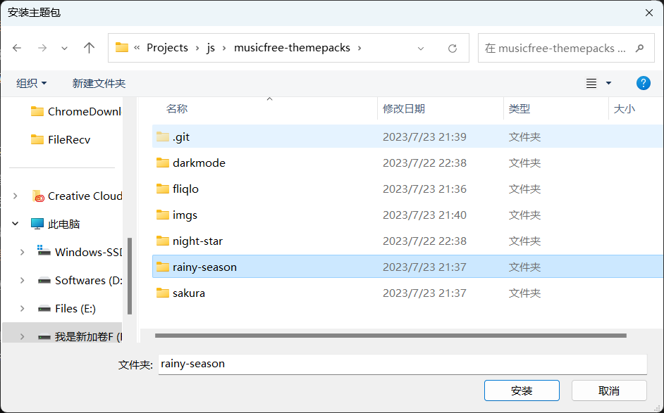

# MusicFree 桌面版的主题包

## 使用方法（0.0.2及以上版本）
1. 下载 [主题包](https://wwwzb.lanzoue.com/i9eDT1dowk7i)，并解压

2. 点击 + 号安装主题，安装解压文件夹内的 .mftheme 文件

3. 软件内切换主题即可

## 使用方法（0.0.2以下）

1. 下载并解压；

2. 点击 + 号安装主题，选择文件夹；

3. 软件内切换主题即可

