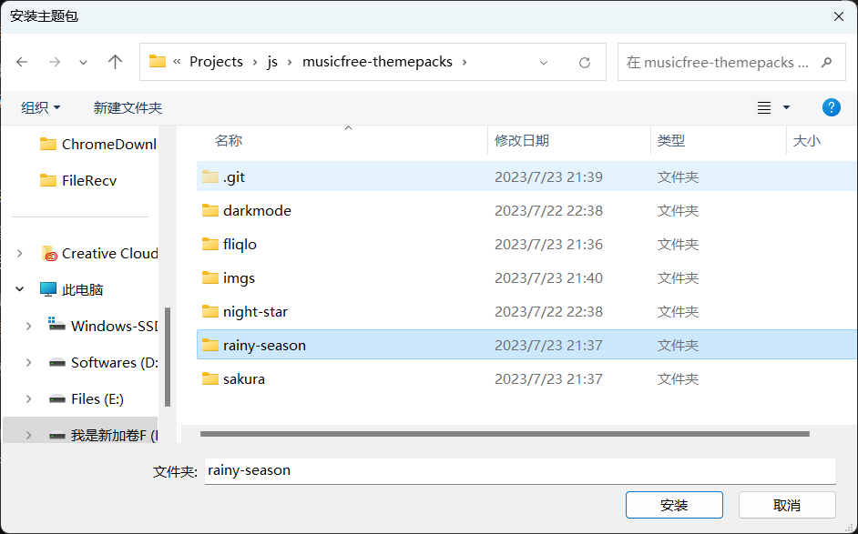

# MusicFree 桌面版主题包

MusicFree 桌面版音乐播放器的社区主题包仓库。

## 分支说明

| 分支 | 说明 |
|------|------|
| `v1/source` | 源代码分支（PR 提交目标） |
| `v1/prod` | 打包产物分支（CI 自动生成，请勿手动修改） |

## 提交主题

请 Fork 本仓库，并向 `v1/source` 分支提交 PR。

详细指南请参阅 [CONTRIBUTING.md](./CONTRIBUTING.md)。

### 快速概览

1. 在 `themes/` 目录下创建主题文件夹（仅允许字母、数字、`-`、`_`）
2. 编写 `config.json`（必填：name, author, preview, description, version, tags）
3. 编写 `index.css` 样式
4. 压缩图片（≤ 500KB/张）和视频（≤ 5MB/个）
5. 本地运行 `npm run validate` 校验
6. 提交 PR 到 `v1/source` 分支

## 安装主题

### 0.0.2 及以上版本

1. 下载 [主题包](https://wwwzb.lanzoue.com/i9eDT1dowk7i) 并解压
2. 点击 + 号安装主题，选择 `.mftheme` 文件
3. 在软件内切换主题

### 0.0.2 以下版本

1. 下载并解压
2. 点击 + 号安装主题，选择文件夹  
   
3. 在软件内切换主题

## 可用标签

主题按标签分类，可在主题市场中按标签筛选。完整标签列表请查看 [`tags.json`](./tags.json)。

## 许可证

[GPL-3.0](./LICENSE)

